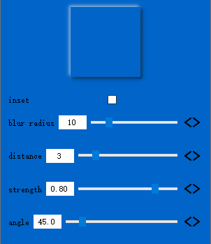
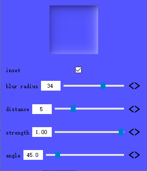

# QNeumorphism
Qt的QSS不支持**box-shadow**，因此无法完成像https://neumorphism.io 这样的效果

笔者通过QGraphicsEffect实现了它的替代方案，可直接用于QWidget，就像下面这样：

```
    QWidget *widget=new QWidget;
    QNeumorphism* neum=new QNeumorphism();
    widget->setGraphicsEffect(neum);
```

克隆该项目，使用QtCreator编译执行，你能够看到**QNeumorphism**的样例 

有效文件：**QNeumorphism.h**、**QNeumorphism.cpp**、**QPixmapFilter.h**

调整参数，你能得到你想要的：

- 点击按钮可打开调色器调整界面颜色
- **blur radius**：模糊半径
- **distance**：距离
- **strength**：阴影的强度
- **angle**：阴影的旋转角度




